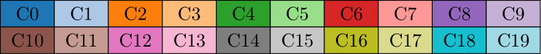
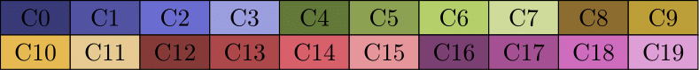
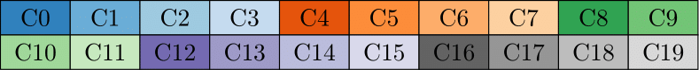

# Tableaucolors
A beautiful and warm colorscheme for LaTeX!

The colors correspond to the ones developed at
[Tableau](https://help.tableau.com/current/pro/desktop/en-us/viewparts_marks_markproperties_color.htm)
and used by
[Matplotlib](https://matplotlib.org/3.1.1/users/dflt_style_changes.html#colors-color-cycles-and-color-maps),
[Vega](https://github.com/vega/vega/wiki/Scales#scale-range-literals), and
[d3](https://github.com/d3/d3-3.x-api-reference/blob/master/Ordinal-Scales.md#category10).


## Installing
Make the style file available to your latex distribution.

## Using
It's just a matter of adding
```
\usepackage{tableaucolors}
```
to the header of your document (This will also include the `xcolor` package).

The default package provides the following colors from the Category 10 list:

Other categories are available as package options:
```
\usepackage[category10]{tableaucolors} % Default option
\usepackage[category20]{tableaucolors}
\usepackage[category20b]{tableaucolors}
\usepackage[category20c]{tableaucolors}
```
Note that only the last option defined will be used.

## Color palettes:
 ### Category 10

 ### Category 20

 ### Category 20b

 ### Category 20c


## Examples
See the `examples` folder for some examples ;)

## Hacking
If you have comments or hacks that you would like to include, send me a message or post an issue or a pull request. Have fun!
